## 1. 设定/etc/hosts文件

> 注意：本文档根据【C66174(主节点)，S66171(从节点)，S66172(从节点)，S66173(mysql)】节点名,包含所有步骤，编写的，操作时请自行匹配自身环境的节点名进行修改。

执行下面的命令，将集群中**所有节点**的IP 地址与主机名写入所有主机的/etc/hosts中，并将本机器映射localhost，完成域名映射的添加。

```shell
$vim /etc/hosts
```

如图：

> 注意：修改对象为【C66174(主节点)，S66171(从节点)，S66172(从节点)】, 请将ipv6的映射关系注释掉

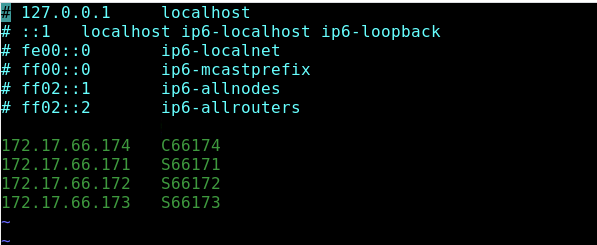


## 2.SSH登录权限设置

- 集群**【C66174(主节点)，S66171(从节点)，S66172(从节点)】**切换到用户hadoop

  ``` shell
  $su hadoop
  ```

  如图：

  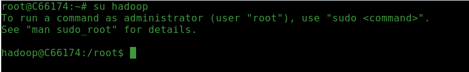

- 在集群**【C66174(主节点)，S66171(从节点)，S66172(从节点)】**上生成公钥和私钥。

  ```shell
  $ssh-keygen -t rsa
  ```

  > 注意：一路回车，将在~/目录下自动创建目录.ssh，内部创建id_rsa（私钥）和id_rsa.pub（公钥）。

  如图：

  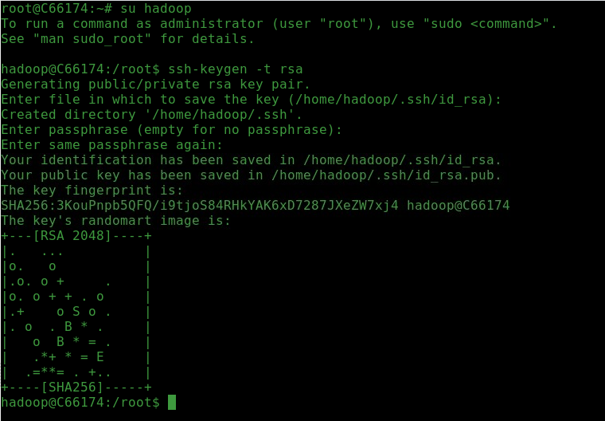

- 在集群的**【C66174(主节点)，S66171(从节点)，S66172(从节点)】**上执行下列命令：

  ```shell
  $cd ~/.ssh
  $ssh-copy-id -i id_rsa.pub hadoop@C66174
  $ssh-copy-id -i id_rsa.pub hadoop@S66171
  $ssh-copy-id -i id_rsa.pub hadoop@S66172
  ```

  > 注意：如下图红线所示
  >
  > Are you sure you want to continue connecting (yes/no)? 请输入yes
  >
  > hadoop@S66172's password: 请输入hadoop

  如图：

  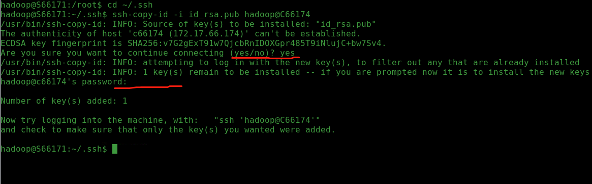

## 3.修改Hadoop配置文件

在集群中**【C66174(主节点)，S66171(从节点)，S66172(从节点)】**上执行下列命令, 进入Hadoop配置目录。

```shell
$cd /usr/local/hadoop/etc/hadoop
```

### slaves

在集群中**【C66174(主节点)，S66171(从节点)，S66172(从节点)】**上执行下列命令, 编辑slaves文件将所有节点的hostname添加到改文件里。

```shell
$vim slaves
```


### core-site.xml

在集群中**【C66174(主节点)，S66171(从节点)，S66172(从节点)】**上执行下列命令, 将namenode替换成个节点主机名称【C66174】

````shell
$vim core-site.xml
````

如图：

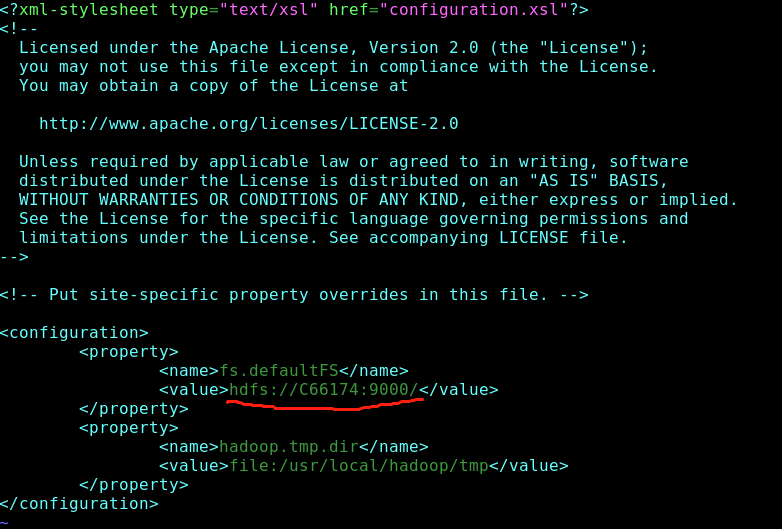

### hdfs-site.xml

在集群中**【C66174(主节点)，S66171(从节点)，S66172(从节点)】**上执行下列命令, 将namenode替换成个节点主机名称【C66174】

```shell
$vim hdfs-site.xml
```

如图：

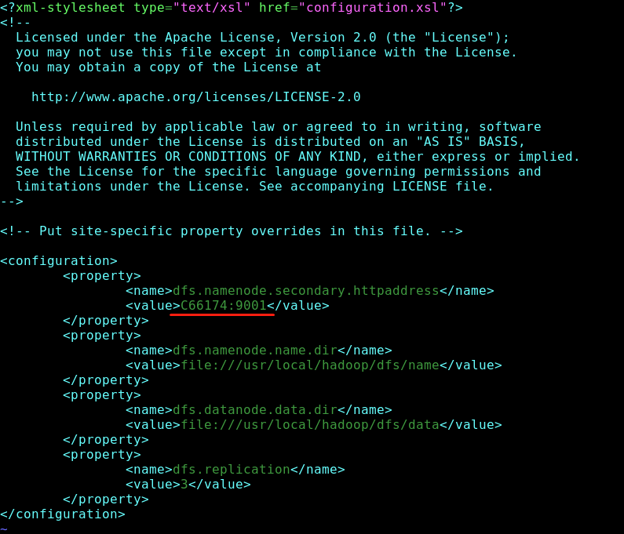

### yarn-site.xml

在集群中**【C66174(主节点)，S66171(从节点)，S66172(从节点)】**上执行下列命令, 将namenode替换成个节点主机名称【C66174】

````shell
$vim yarn-site.xml
````

如图：

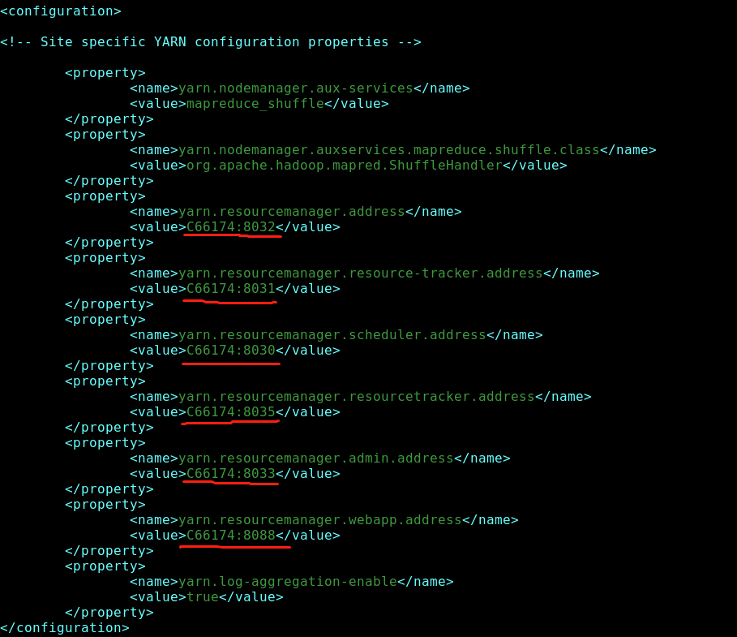

## 4.格式化NameNode节点【C66174】

> 注意： 只在namenode节点执行下面的命令。

```shell
$cd /usr/local/hadoop
$bin/hdfs namenode -format
```

如图：

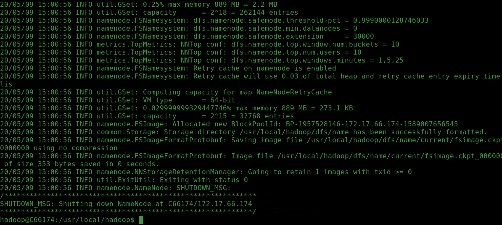

## 5.在主节点【C66174】启动Hadoop服务

> 注意： 只在主节【C66174】点执行下面的命令。

```` shell
$cd /usr/local/hadoop
````

```shell
$sbin/start-all.sh 
```

如图：

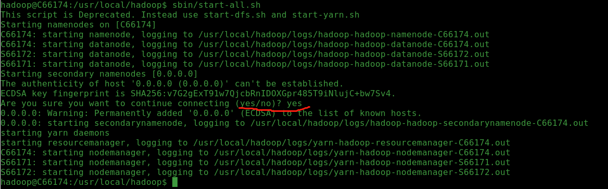

在集群中**【C66174(主节点)，S66171(从节点)，S66172(从节点)】**上执行下列命令，验证是否成功。

````shell
$jps
````

**主节点【C66174】如图：**

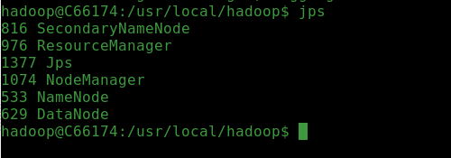

**从节点【S66171,S66172】如图：**

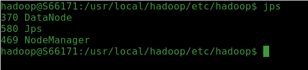

## 6.验证

在主节点【C66174】切换图型界面，打开浏览器，输入下列网站。

> http://C66174:8088/cluster 访问YARN管理界面。例如：

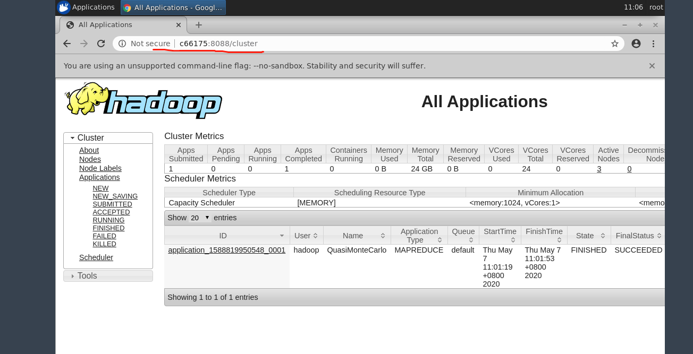

> http://C66174:50070查看HDFS管理界面。例如：

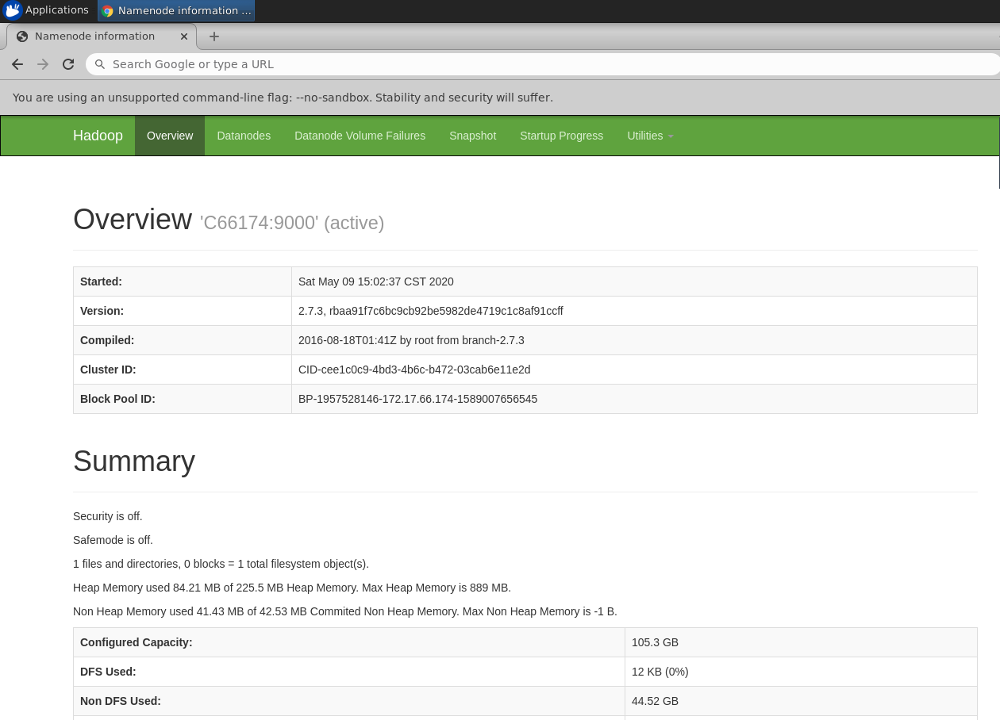

## 7.hbash设置

在集群中**【C66174(主节点)，S66171(从节点)，S66172(从节点)】**上执行下列命令, 将namenode替换成个节点主机名称【C66174】

```shell
$ vim /usr/local/hbase/conf/hbase-site.xml
```

如图：

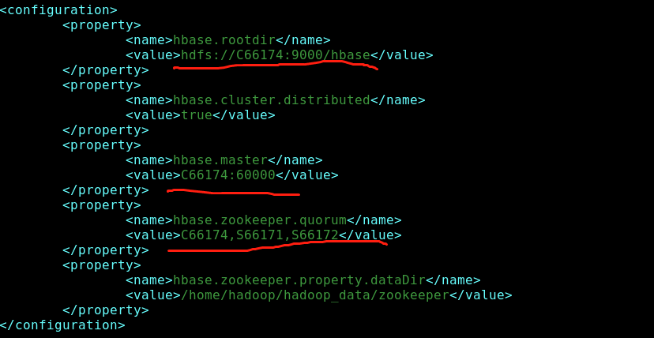

````shell
$ vim /usr/local/hbase/conf/regionservers
````

如图：


只在主节点【C66174】上执行下列命令

```shell
$ cd /usr/local/hbase
$ bin/start-hbase.sh
```

如图：

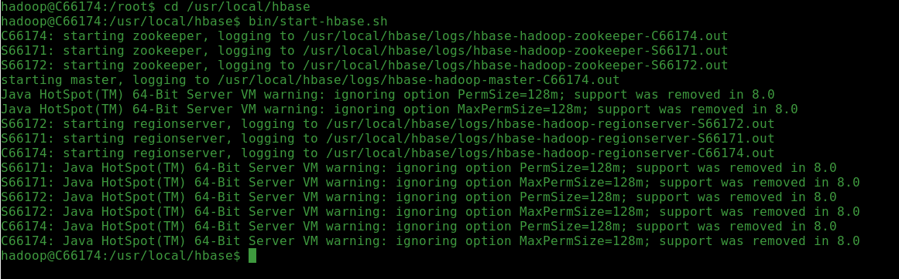


在集群中**【C66174(主节点)，S66171(从节点)，S66172(从节点)】**上执行下列命令，验证是否成功。

````shell
$jps
````

**主节点【C66174】如图：**

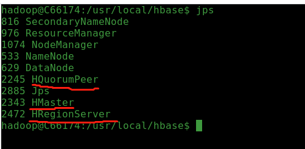

**从节点【S66171,S66172】如图：**

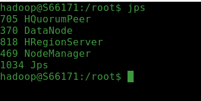

**在主节【C66174】点进入shell界面：**

````shell
$ bin/hbase shell
````

如图：

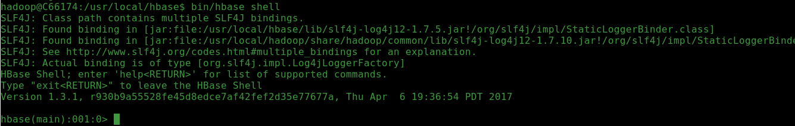

通过下面的命令推出：

```shell
$ exit
```


在主节点【C66174】切换图型界面，打开浏览器，输入下列网站。

> http://C66174:16010/master-status 访问HBase管理界面。例如：

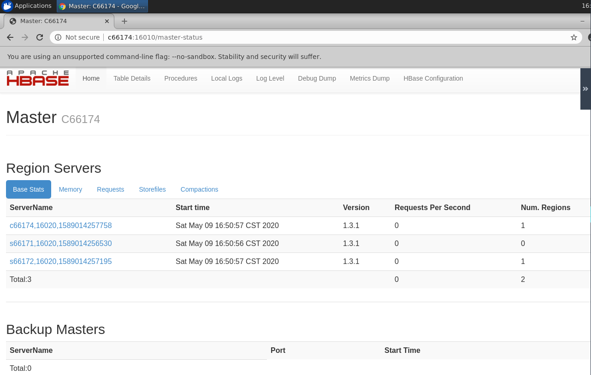


## 8, hive设置

在集群中主节点上执行下列命令, 将【javax.jdo.option.ConnectionURL】修改成【S66173】

````shell
$ cd /usr/local/hive/conf
$ vim ./hive-site.xml
````

如图：


**执行下面的命令，初始化元数据**

````shell
$ cd /usr/local/hive/bin
$ ./schematool -dbType mysql -initSchema
````

如图：

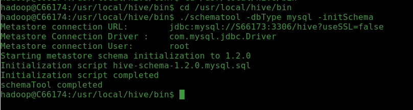


## 9.测试sqoop与MySQL

```shell 
$ sqoop list-databases --connect jdbc:mysql://S66173:3306/ --username root -P
```

如图：

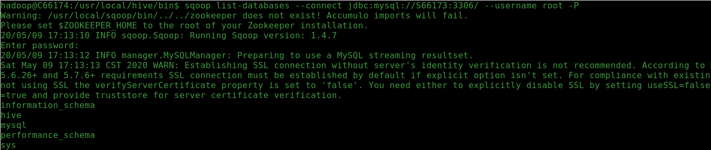